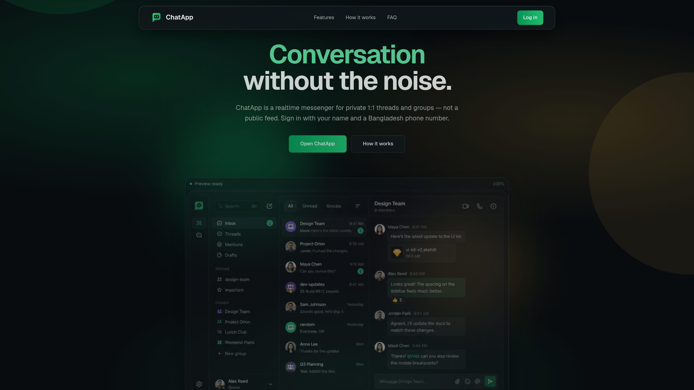

# ChatApp



**ChatApp** is a real-time messenger client for private 1:1 threads and groups. It is a Next.js 16 frontend that talks to the assignment backend over REST + Socket.io. Sign in with a name and a Bangladesh phone number — no password. New numbers register; known numbers return.

There is **no local mock chat API**. Auth, conversations, messages, and groups live on the hosted backend.

**API origin (default):** [frontend-task-chatapp.onrender.com](https://frontend-task-chatapp.onrender.com)  
**Live OpenAPI:** [frontend-task-chatapp.onrender.com/docs](https://frontend-task-chatapp.onrender.com/docs/)

For architecture, routes, sockets, stores, and design decisions — see **[ARCHITECTURE.md](./ARCHITECTURE.md)**.

For the assignment brief, observed API, and visual system — see **[docs/](./docs/)**.

---

## Tech Stack

### Core

<div>


</div>

### Data, auth & realtime

<div>


</div>

### UI & tooling

<div>


</div>

**Key dependencies:** `next` · `react` · `@tanstack/react-query` · `zustand` · `axios` · `socket.io-client` · `react-hook-form` · `framer-motion` · `lucide-react` · `date-fns` · `clsx` · `tailwind-merge`

---

## Features

- **Landing** — marketing page for the product (hero, capabilities, features, how-it-works, FAQ, CTA)
- **Phone sign-in** — name + Bangladesh `+880` number; JWT in `localStorage`; session restore via `GET /api/auth/me`
- **Inbox** — conversation list with All / Unread / Groups filters and local search
- **Direct threads** — search people, open or resume a 1:1 chat
- **Groups** — create, rename, add, promote admin, remove, leave
- **Realtime** — Socket.io `message:new` and `conversation:updated`; reconnect refetches gaps
- **Optimistic send** — `POST /api/messages` with a pending bubble; socket echo replaces the placeholder
- **Unread** — badges on other threads; the open thread does not steal scroll
- **Search debounce** — people search waits **600ms** after typing stops (`SEARCH_DEBOUNCE_MS`); React Query caches results 60s
- **Responsive** — below `md`, list and thread are separate views (not two squeezed columns)

---

## Prerequisites

| Requirement | Version / notes                          |
| ----------- | ---------------------------------------- |
| **Node.js** | `>=24.11.0` (see `package.json` engines) |
| **npm**     | Package manager for this repo            |

No local database. The client uses the hosted Chat API (or an origin you set in env).

---

## First-time setup

### 1. Clone and install

```bash
cd frontend-task-chatapp
nvm use          # if you use nvm — Node 24
npm install
```

### 2. Environment variables

Optional. Defaults already point at the assignment API.

| Variable                      | Required | Notes                                                                                 |
| ----------------------------- | -------- | ------------------------------------------------------------------------------------- |
| `NEXT_PUBLIC_CHAT_API_ORIGIN` | No       | Host origin **without** `/api`. Default: `https://frontend-task-chatapp.onrender.com` |

Create `.env.local` only if you need a different backend:

```bash
NEXT_PUBLIC_CHAT_API_ORIGIN=https://frontend-task-chatapp.onrender.com
```

REST calls go to `{ORIGIN}/api`. Socket.io connects to `{ORIGIN}` (not `/api`).

### 3. Start the dev server

```bash
npm run dev
```

Open [http://localhost:3000](http://localhost:3000).

| Path         | What you get          |
| ------------ | --------------------- |
| `/`          | Landing page          |
| `/login`     | Name + phone sign-in  |
| `/chat`      | Inbox (auth required) |
| `/chat/[id]` | Active thread         |

---

## Scripts

| Command                | Description                    |
| ---------------------- | ------------------------------ |
| `npm run dev`          | Next.js dev server (Turbopack) |
| `npm run build`        | Production build               |
| `npm run start`        | Run production server          |
| `npm run lint`         | ESLint                         |
| `npm run format`       | Prettier write                 |
| `npm run format:check` | Prettier check                 |

Type-check (not a package script): `npx tsc --noEmit`.

---

## After pulling changes

```bash
npm install
npm run dev
```

Restart the dev server after changing `.env.local`.

---

## Troubleshooting

| Problem                                      | Fix                                                                                                                  |
| -------------------------------------------- | -------------------------------------------------------------------------------------------------------------------- |
| Wrong Node version                           | `nvm install 24.11.0 && nvm use`                                                                                     |
| Login works then `/chat` bounces to `/login` | Wait for session restore (`GET /api/auth/me`). Hard-reload if `chat_jwt` was cleared.                                |
| Empty inbox / 401 after idle                 | JWT expired or invalid — sign in again. Axios clears auth on 401.                                                    |
| Names show as “Direct message”               | List payloads often return participant **ids only**. Search that person once so the directory can remember the name. |
| People search fires every keystroke          | Search fields must use `debounceMs={SEARCH_DEBOUNCE_MS}` (600). Restart `npm run dev` after pull.                    |
| Socket never connects                        | Confirm origin has **no** `/api` suffix. Browser must reach the Socket.io host, not only REST.                       |
| Health badge / CORS on `/health`             | Browser calls to the public `/health` URL are often blocked; the app proxies via `GET /api/health`.                  |
| Paperclip does nothing                       | Attachments are not in the message API. The control is disabled with “coming soon”.                                  |
| Stale user after testing another account     | DevTools → Application → Local Storage → remove `chat_jwt` and `chat_user_directory`.                                |

---

## Docs

| File                                           | Contents                                      |
| ---------------------------------------------- | --------------------------------------------- |
| [ARCHITECTURE.md](./ARCHITECTURE.md)           | Routes, data flow, sockets, stores, decisions |
| [docs/API.md](./docs/API.md)                   | Observed REST + socket contract               |
| [docs/PRD.md](./docs/PRD.md)                   | Assignment requirements                       |
| [docs/design-style.md](./docs/design-style.md) | Visual system (graphite / emerald)            |

---

## Thought process (assignment Part 3)

This client is a **frontend against an existing backend**. I did not invent REST routes or a database. The work is mapping an under-specified API onto a product UI that still feels complete.

**What I optimized for**

1. **Session restore first.** Auth starts as `restoring` until `GET /api/auth/me` finishes, so a valid JWT is never bounced to login on reload.
2. **Defensive payloads.** OpenAPI documents requests more than responses. `unwrapObject` / `unwrapArray` and `normalizeMessage` / `normalizeConversation` accept both bare objects and `{ data }` envelopes so a shape change does not crash a screen.
3. **Realtime without fighting REST.** Sends go through `POST /api/messages` (so errors and optimistic UI stay on one path). The socket is for **incoming** `message:new` and list invalidation. Echoes of our own send replace the pending bubble instead of duplicating it.
4. **Unread stays put.** A message in another thread increments a badge. It does not jump the thread you are reading.
5. **Names need a directory.** Direct-chat lists often return ids only. `userDirectory` remembers people from search, login, and sockets, keyed by user id and conversation id.
6. **Search waits until you stop typing.** People search is debounced **600ms** at the input (`debounceMs`) so `/users/search` is not called per key. React Query caches the settled term.

**What I refused to fake**

- No attachment upload (API is `{ conversationId, text }` only).
- No “Online” presence for other users (no presence API).
- No video/call buttons.

Deeper maps, event tables, and folder layout: **[ARCHITECTURE.md](./ARCHITECTURE.md)**.
